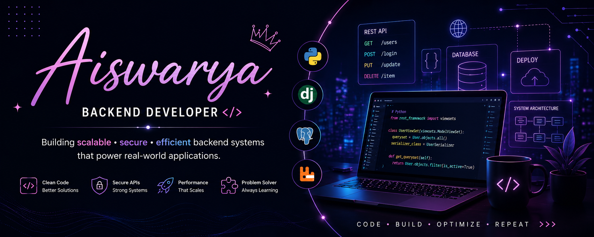

<h1 align="center">Hi 👋, I'm Aiswarya</h1>
<h3 align="center">💻 Backend Developer | Django | REST APIs | Scalable Systems 🚀</h3>

  

---

## 💫 About Me

💻 Backend Developer with experience in building **scalable, secure, and high-performance systems**

⚙️ Skilled in **Python, Django, REST APIs**, and backend architecture design

🚀 Experienced in **async processing (Celery, RabbitMQ)** and handling high-traffic systems

🗄️ Strong in **PostgreSQL, MongoDB, and data migration strategies**

🔐 Focused on **clean code, secure APIs, and system optimization**

🤝 Agile team player collaborating with frontend, QA, and product teams

🌱 Always learning and building impactful solutions

💼 Open to **Backend / Full Stack opportunities (UAE)**

---

## 🛠️ Tech Stack

  

---

## 🚀 Featured Work

- 🔹 Developed **50+ RESTful APIs** improving system performance & stability  
- 🔹 Built **async pipelines (Celery + RabbitMQ)** for high-traffic systems  
- 🔹 Automated **MongoDB → PostgreSQL migration** (90% manual effort reduced)  
- 🔹 Created **dynamic quotation engine** improving delivery time by 40%  
- 🔹 Designed **secure APIs for healthcare & tracking systems**  

---

## 📊 GitHub Stats

  

  

---

## 🌐 Connect with Me

  

---

✨ Code • Build • Optimize • Repeat ✨

